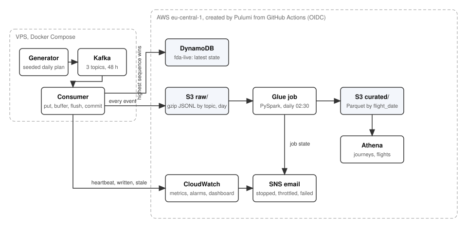
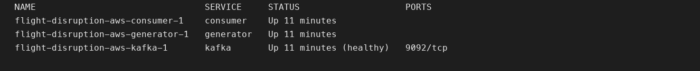
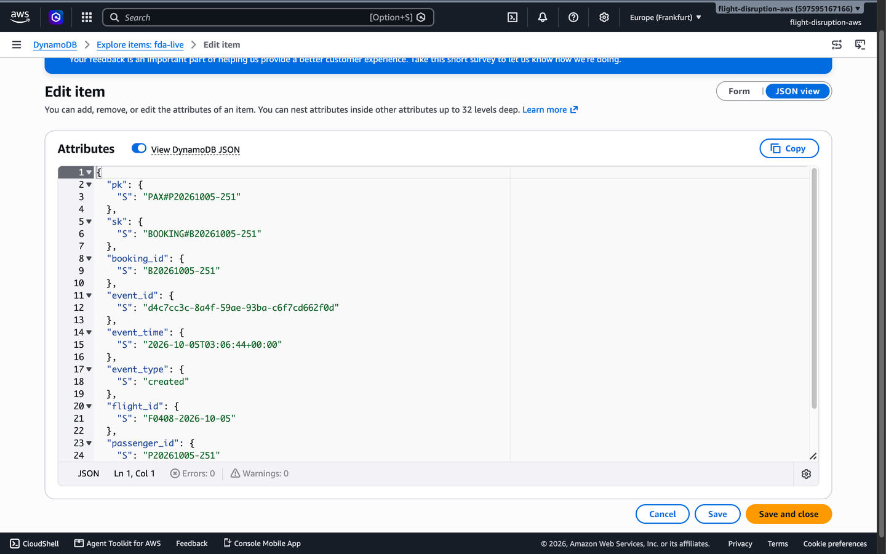
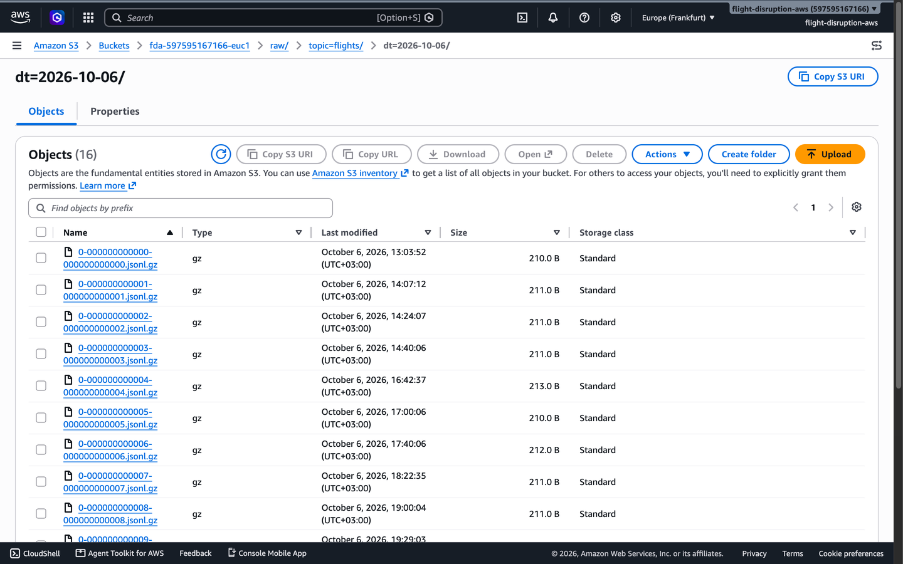
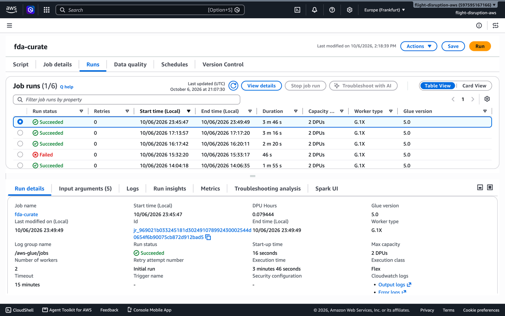
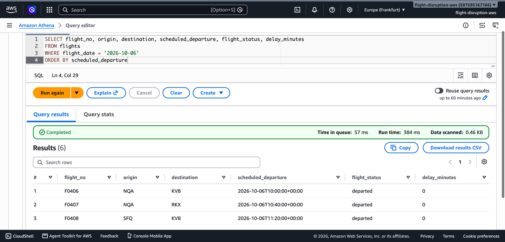
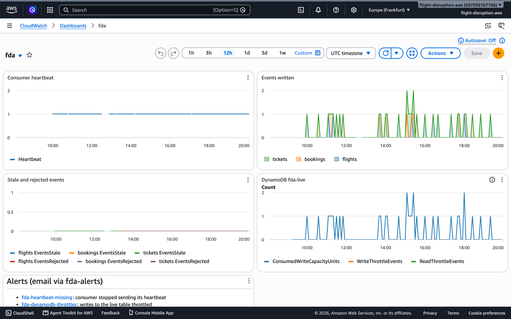
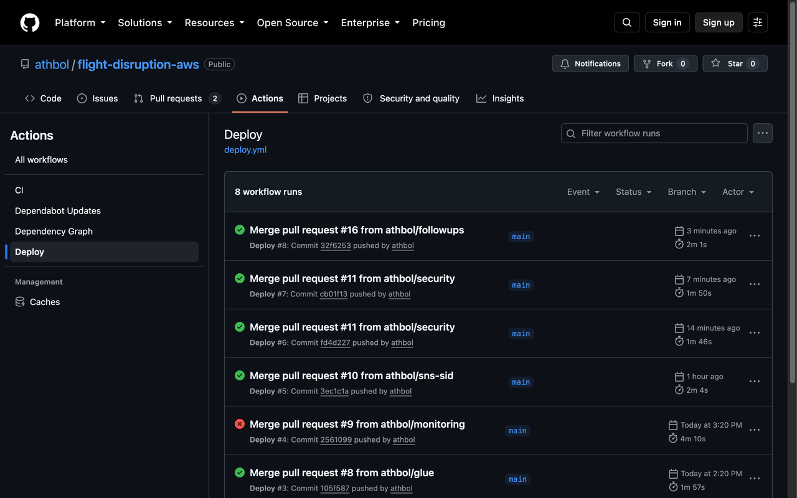
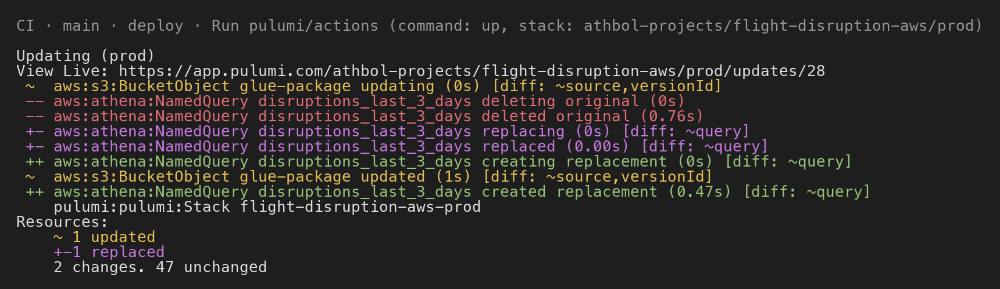
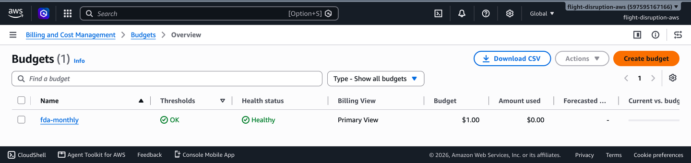

# flight-disruption-aws

A small airline runs 24 flights a day. Some are delayed, some are cancelled, and the passengers on a cancelled flight are rebooked or refunded. This repo generates those events as synthetic data, streams them through Kafka, keeps a live status table in DynamoDB, archives every event in S3, and turns the archive into query-ready Parquet tables once a day with Glue and Athena. Everything on AWS is created by Pulumi from a GitHub Actions workflow. It runs for under one dollar a month.

I built it to show, on a public repo with no customer data, how I would rebuild the disruption pipeline I worked on at an airline: the same ordering, duplicate and late-data problems, the same split between a live store and an analytical store, and the same deployment and alerting around it.

## How it fits together



| Step | Runs on | What it shows |
|------|---------|---------------|
| A generator plans each day from a seed and emits booking, ticket and flight events at their scheduled times, with lag, duplicates and held cancellations mixed in | Docker on a VPS | A deterministic, replayable source that is messy in the ways real feeds are |
| Events sit on three Kafka topics with 48 hours of retention | Kafka 4.3 (KRaft), one broker, same VPS | Nothing on the AWS side needs to be up for the source to keep going |
| A consumer writes the newest state of each flight, booking and ticket | DynamoDB table `fda-live` | Writes are idempotent and safe against out-of-order delivery |
| The same consumer archives every event as gzip JSONL, partitioned by topic and day, and commits Kafka offsets only after the archive write succeeds | S3 `raw/` | At-least-once delivery with no lost events |
| A daily PySpark job dedupes the archive, keeps the latest version of each entity, joins them into passenger journeys and rewrites the last four days as Parquet | Glue 5.0, 2 workers, Flex | Late and duplicate events are repaired without a backfill |
| Saved queries answer "which journeys were disrupted", "which flights were late yesterday" and "what happened to this passenger" | Athena, Glue catalog with partition projection | Analysts query it with plain SQL and nothing to keep running |

Pulumi describes all of it in `infra/`. A push to `main` runs `pulumi up` through GitHub Actions, which gets its AWS credentials from OIDC instead of stored keys. CloudWatch alarms and an EventBridge rule send an email when the consumer stops, when DynamoDB throttles, or when the Glue job fails.

## It runs

Screenshots from the live system, in the order the data flows.

<!-- TODO: screenshots 01 to 10 go in docs/screenshots/ (see handoff T3). -->

1.  The three containers on the VPS. Kafka is healthy.
2.  One booking in the live table.
3.  Raw archive, one object per flush.
4.  The daily curate job, succeeded.
5.  Disruptions over the last three days.
6.  Heartbeat, events written and stale events skipped.
7.  The email that arrives when the consumer stops.
8.  Every push to main runs the tests and then `pulumi up`.
9.  The Pulumi step of that deploy: one resource changed, 48 unchanged.
10.  The 1 USD monthly budget.

## One passenger, two stores

<!-- TODO: fill from the live system after the first full-day Glue run on 2026-10-07. -->

The same synthetic passenger as the consumer sees them in DynamoDB and as an analyst sees them in Athena after the daily job.

The DynamoDB item is the latest event for that booking, keyed `PAX#<passenger>` / `BOOKING#<booking>`, so one query by passenger returns their bookings and tickets:

```json
{ "pk": "PAX#...", "sk": "BOOKING#...", "event_type": "rebooked", "sequence": 2, "flight_id": "...", "original_flight_id": "..." }
```

The Athena row, from `sql/passenger_journey.sql`, joins that booking with both flights and the ticket, and classifies the journey:

```
passenger_id | flight_id | flight_status | booking_status | original_flight_id | original_flight_status | ticket_status | disruption
P...         | F0...     | departed      | rebooked       | F0...              | cancelled              | exchanged     | cancelled_rebooked
```

## The hard parts

Out-of-order events. Every event carries a per-entity `sequence`. The consumer writes with a conditional put that only succeeds if the stored sequence is lower, so an old event that arrives late cannot overwrite a newer state. It counts the rejected write as `EventsStale` and moves on.

Duplicates. Event ids are UUIDv5 of seed, entity and sequence, so a re-sent event has the same id as the original. The conditional put drops it in DynamoDB. The daily job drops it again with `dropDuplicates("event_id")` before it picks the latest version of each entity.

Late data. The generator delays some events by up to 36 hours and holds some cancellations for a few hours. The daily job therefore reads the last four days of the archive, rebuilds journeys for flights in that window, and overwrites only those date partitions. A flight that got its last event two days after it flew ends up correct on the next run, with no manual backfill.

Offsets after the flush. The consumer buffers events and uploads them to S3 every 5000 records or every five minutes. It commits Kafka offsets only after the upload succeeds. A crash between the two replays a few events, and the two mechanisms above absorb the replay. The trade is at-least-once for never losing an event.

Least privilege per step. The consumer has one IAM user that can write to one table, one S3 prefix and one metric namespace, and only from the VPS address. The Glue job has a role that reads `raw/` and writes `curated/`. GitHub Actions assumes a deploy role through OIDC on pushes to `main` and a read-only role on pull requests. Anything the deploy role creates must carry a permissions boundary that has no IAM or STS rights, so CI cannot escalate through a new identity.

A one dollar budget. A budget alert at 80% and a forecast alert at 100% of 1 USD. The Athena workgroup refuses queries that would scan more than 100 MB. Raw objects expire after 30 days.

## Run it yourself

The tests need Python 3.11, [uv](https://docs.astral.sh/uv/) and Java 17 for the PySpark tests.

```sh
git clone https://github.com/athbol/flight-disruption-aws && cd flight-disruption-aws
uv sync --locked
uv run pytest
```

The tests cover the generator plan, the DynamoDB write rule, the S3 layout, the consumer loop, the Spark job and every IAM policy. The consumer and DynamoDB tests run against moto, so there is no AWS account involved.

Deploying the real thing needs an AWS account, a Pulumi account and a host for the Docker Compose stack. `docs/runbook.md` has the steps, the checks and how to test each alarm. The three saved Athena queries are in `sql/`: disruptions over the last three days, delayed flights yesterday, and one passenger's journeys.

## Cost

Estimated monthly cost at this volume, before any credits. Measured figures replace this after the first full month.

| Service | Use | USD / month |
|---------|-----|-------------|
| DynamoDB | 5 read and 5 write units, provisioned | 0 (always-free tier) |
| Glue | one Flex run a day, about 3 DPU-minutes | ~0.45 |
| S3 | a few MB of raw and curated data | ~0.02 |
| Athena | KBs scanned per query | ~0 |
| CloudWatch | 10 custom metrics, 2 alarms, 1 dashboard | 0 (free tier) |
| SNS, EventBridge, Budgets, CloudTrail | one email topic, one rule, one budget, one trail | 0 |
| Total | | under 1 |

The VPS is shared with other projects and not counted.

## What it does not do

* An event that arrives more than two days after its flight is left out of the curated tables for good.
* One Kafka broker on one box. Kafka itself is a single point of failure, which is fine for a demo and wrong for a product.
* No schema registry. The three schemas live in `src/fda/schemas.py` and every module reads them from there.
* If the generator is down for part of a day, the bookings for a flight whose events were all skipped do not show up in `journeys` for that day.
* CI can create new `fda-` roles and users. The permissions boundary stops them from reaching IAM or STS, but it does not stop them from existing.
* CI deploys with a personal Pulumi access token stored as a GitHub secret.

`docs/decisions.md` records why it is built this way and what the alternatives cost.

## Stack

Python 3.11, confluent-kafka, boto3, Apache Kafka 4.3 (KRaft), DynamoDB, S3, Glue 5.0 (Spark 3.5), Athena, Pulumi, GitHub Actions with OIDC, CloudWatch, SNS, EventBridge, Docker Compose, uv, ruff, pytest, moto.

MIT licence.
